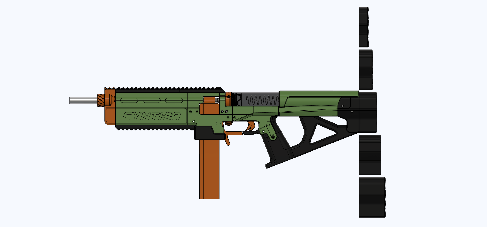
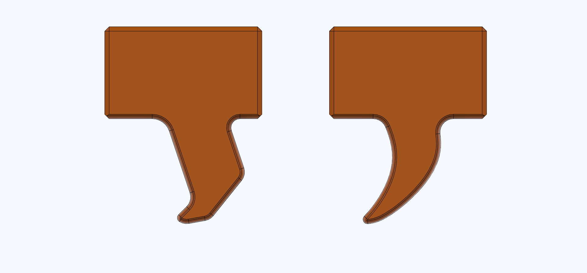
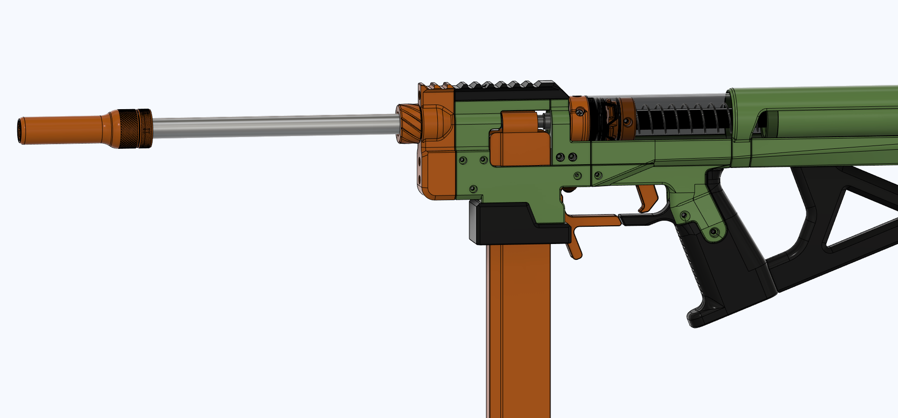
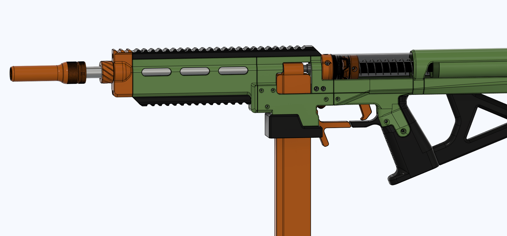
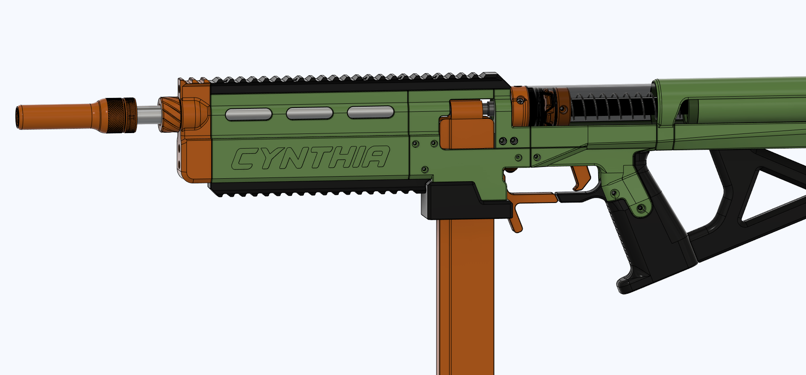

# Cynthia
Cynthia is a Talon mag fed bolt action blaster, customizable for any need.

Changelog (click this text, it's a dropdown!)

- Changelog: 3-31-2023: Blaster release.
  

# THIS BLASTER RELEASES ON THE 30TH/31ST OF MARCH, 2023. DOWNLOADS BEFORE THEN WILL LIKELY HAVE UNFINISHED PARTS.

## Description

Cynthia is a bolt action blaster using the same basic layout as the Indra by CaptainSlug. Cynthia began with me figuring out how to fix all the issues with the Indra, but I pretty quickly realized it would be easier to design a whole new blaster from the ground up, rather than fix the Indra part by part.
Cynthia contains no original Indra parts.

Firing Demo: https://youtube.com/clip/UgkxEHjsmXU370IFB8PHDxiK1v4qDb7vdCwZ

Blaster Overview: https://www.youtube.com/watch?v=nF_tcDXLQYM

Customization Overview: https://www.youtube.com/watch?v=mZe6dWdQUs0

Assembly Video: WIP

## Reviews

Videos:
- BansheeIndian: https://www.youtube.com/watch?v=CzInCRDko88

## What does Cynthia fix vs the Indra?

The Indra by CaptainSlug is infamous for it's many issues. Thankfully, Cynthia fixes almost all the issues the Indra had:
- Fixed catch reliability by using the plunger system from the SLAB (modified to be longer)
- Improved plunger tube attachment strength (glue and more attachment area)
- Improved ramrod retention
- Made Cynthia slimmer
- Lengthened the stock to be Caliburn V4 length.
- Massively improved trigger feel
- Made the blaster lighter
- Less hardware cost
- Vastly improved front half rigidity
- A lot easier to assemble, disassemble, and swap springs.
- The thumbhole stock is easily removable, and is not required (on the Indra, the stock rod is required for blaster rigidity)
- Probably more stuff that I can't remember

## Optional Parts

There are many variant parts for Cynthia:
- Left and right handed parts
- Front Ends
- - Cynthia text or no Cynthia text
- - Ported and unported
- - Side rail or no side rail
- - Slim front end
- - Stubby short front end
- Two grip styles
- Several trigger styles
- Thumbhole stock or no thumbhole stock
- Fully enclosed plunger tube travel space, or open plunger tube space
- - Fully enclosed is good for people with beards, to protect yourself from hair-rippage during priming
- Tons of bolt handle options and lengths
- Locking bolt handle (for "realistic" bolt action coolness) or freely-moving bolt handle
- - Optional ball detent makes the bolt handle clicky as well, which feels really good.
- Optional muzzle with extra bottom picatinny (for bipod mounting)
- Optional picatinny rail replacements with no picatinny, for aesthetic sleekness
- Optional front grip
- Magwell panels with or without elastic holes, respectively for use with elastic or a spring on the mag release
- etc

Here are some good Picatinny sights if you want some:
- https://www.thingiverse.com/thing:2376150/files FrontPip and Pip in the Caliburn fileset are great iron sights.
- https://www.thingiverse.com/thing:1667830
- https://www.thingiverse.com/thing:2829229
- https://www.thingiverse.com/thing:5103083

### Performance:
As testing is done, I will update this part of the page with common spring/barrel combos for specific FPS numbers.

Keep in mind that SCARs usually reduce performance a bit.

Cynthia performance can be roughly approximated by using Talon Claw T4 performance estimates (in regards to barrel length and spring choice).

## Sellers
Hardware is available from these sellers:
- OutOfDarts: https://outofdarts.com/products/cynthia-hardware-kit
- SilverFoxIndustries: https://silverfoxindustries.shop/collections/new-products/products/cynthia-hardware-kit

Fully printed/assembled blasters are available from these sellers:
- OutOfDarts: WIP
- SilverFoxIndustries: WIP

## Print Info

Cynthia uses less than one 1kg PLA spool (if you were to print it all one color).

Infills:
- Black: 
- - PlungerRod, PlungerCap, 100% Gyroid, 5+ walls.
- - ThumbholeStock needs a brim.
- - Everything else, 20% Gyroid, 5 walls. 

- Orange: 
- - BoltBase, BoltHandle, FrontGripKeeper, Catch, CatchPusher, PlungerHead, 100% infill, 5 walls.
- - BoltHandle, FrontGripKeeper, CatchPusher need brims.
- - Everything else, 20% Gyroid, 5 walls. 

- Green: 
- - MagwellBack, Magwell_L, Magwell_R, Grip_L, Grip_R, 100% infill, 5 walls.
- - All the tall green parts benefit from a brim.
- - To be safe, I recommend you print each tall part one at a time.
- - Everything else, 20% Gyroid, 5 walls. 

Some parts have tight tolerances (mainly the dovetails in the catch area on the top cover print). Sanding and/or filing is recommended to make the dovetails go together smoothly. The top cover part can be broken if you try and force the dovetails together.

## Hardware

Full hardware list: https://docs.google.com/spreadsheets/d/1t6-6BqBstn1Ad-zIxsB0FqWth3nB00lHC9SVksAbSmY/edit?usp=sharing

H4 bar spec for those interested: 

H4 bars can be cut down from C4 bars using the bar cutting tool (included in Cynthia files).

## Assembly

Video: WIP

Plunger Tube Gluing Guide: https://www.youtube.com/watch?v=0BNuwjhlNqI
(Super glue works, epoxy is best)

### Beta Tester Thanks

Thanks to my beta testers who contributed features and variant parts to Cynthia! Here's a list of who did what: (click this text)

- Chance made a new trigger for Cynthia, fixed some trigger wobble issues, and recommended adding a ball detent to the bolt handle.

Also, thanks to all my beta testers for their feedback while designing Cynthia. Couldn't have done it (this well) without you guys(and gals)!

- Chance
- WonderBoy
- BansheeIndian
- Greg from OutOfDarts
  

## Misc.

**If you build any of my designs, I'd love to see yours! Feel free to message me on Discord (Sillybutts#5905) or tag me on a post on Reddit (u/SillyTheGamer).**

**If you are having issues with any of my designs, let me know on Discord (Sillybutts#5905) or Reddit (u/SillyTheGamer).**

**If you wish to print and sell this item, please contact me for licensing. I can be reached on Discord (Sillybutts#5905) or Reddit (u/SillyTheGamer). iamsillybutts@gmail.com email too.**
**你好！ 我擁有這個設計。 想生產請聯繫我. 你好！ 我拥有这个设计。 如果你想生产，请联系我.**

 This work is licensed under a <a rel="license" href="http://creativecommons.org/licenses/by-nc-sa/4.0/">Creative Commons Attribution-NonCommercial-ShareAlike 4.0 International License</a>.

**Disclaimer: This is not a toy. This blaster is meant for hobbyists, not children. Blaster must be operated correctly to avoid injury. I am not responsible for any injuries from this blaster. Please use a bright/blaze orange muzzle and barrel cap on this blaster. Consult local laws before building this high powered blaster.**

## If you like what I do, please consider supporting me!

**I don't charge for my files, so any donations or merch purchases would be greatly appreciated!**

 https://www.redbubble.com/people/Sillybutts/shop RedBubble full of fun Nerf-y sticker and merch designs!  

 https://www.patreon.com/sillybutts Monthly donations

 https://www.buymeacoffee.com/sillybutts One-time donations

## Images

